# 키와 기본 명령어

---
## [Redis UI 접속](http://localhost:5540/)

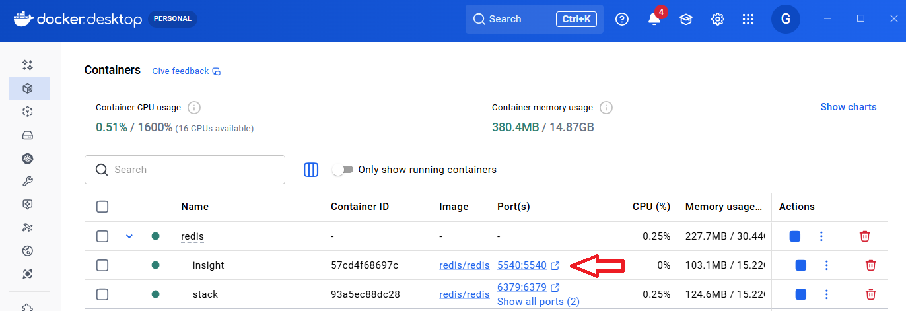

---
### Add Redis database

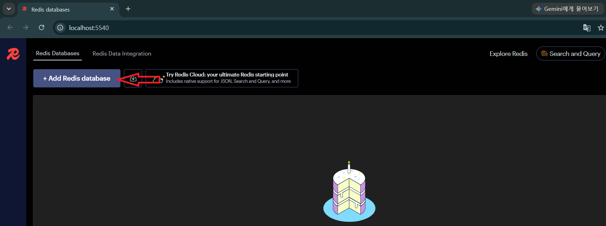

---
- `Host`: redis
- `Port`: 6379
- `Database Alias`: tutorial

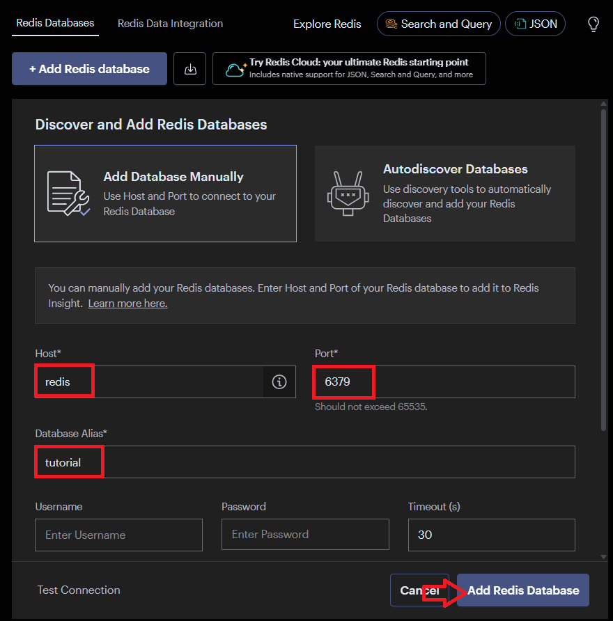

---
### Connect database

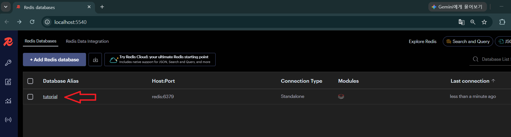

---
## 학습 목표

- 일관된 규칙으로 Redis 키를 설계할 수 있습니다.
- 키의 존재 여부, 자료형, 삭제 여부를 확인할 수 있습니다.
- `KEYS`와 `SCAN`의 차이를 설명할 수 있습니다.

---
## 1. 키 이름 설계

Redis에는 테이블이 없으므로 키 이름이 데이터의 의미를 전달해야 합니다.
이 강의에서는 다음 규칙을 사용합니다.

```text
서비스:대상:식별자[:속성]
```

```text
shop:product:1001
shop:product:1001:views
community:user:7:session
```

---
### 좋은 키의 조건

- 의미가 분명하고 충돌하지 않습니다.
- 너무 짧거나 지나치게 길지 않습니다.
- 같은 종류의 키는 같은 패턴을 사용합니다.
- 개인정보를 키 이름에 직접 넣지 않습니다.

---
## 2. 기본 저장과 조회

---
```redis
SET shop:product:1001 "무선 키보드"
```
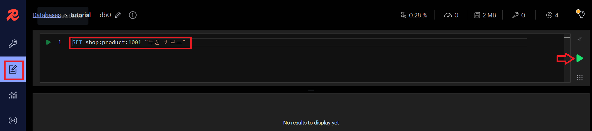

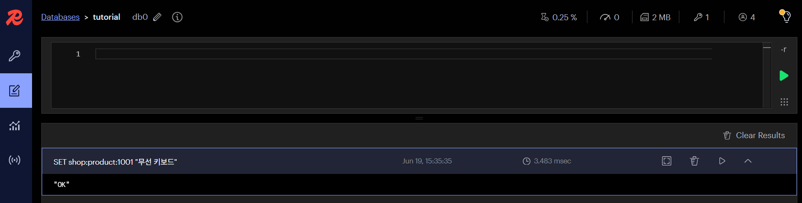

---
```redis
GET shop:product:1001
```
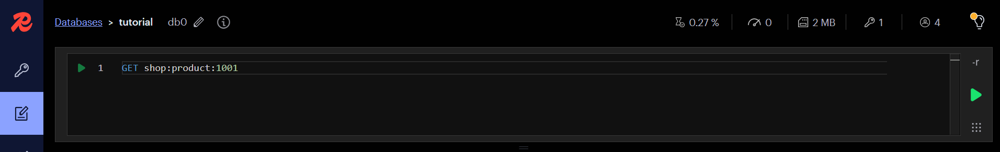

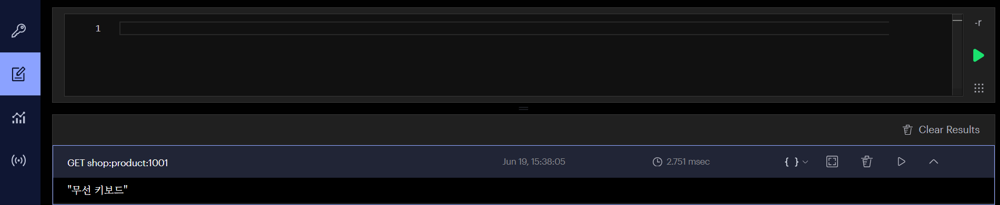

---
- `EXISTS key`: 키가 있으면 `1`, 없으면 `0`
```redis
EXISTS shop:product:1001
```
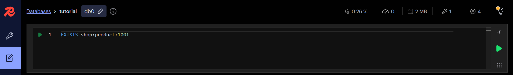

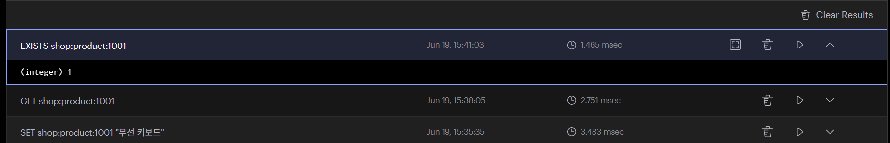

---
- `TYPE key`: 키에 저장된 자료형 확인
```redis
TYPE shop:product:1001
```
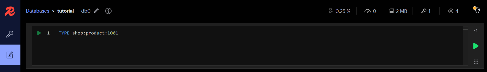

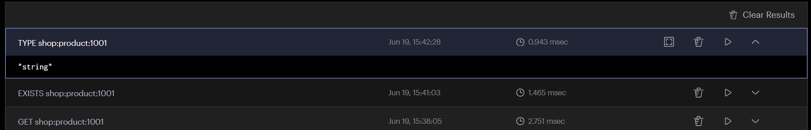

---
- `DEL key [key ...]`: 하나 이상의 키를 즉시 삭제
```redis
DEL shop:product:1001
```
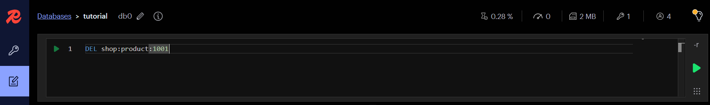

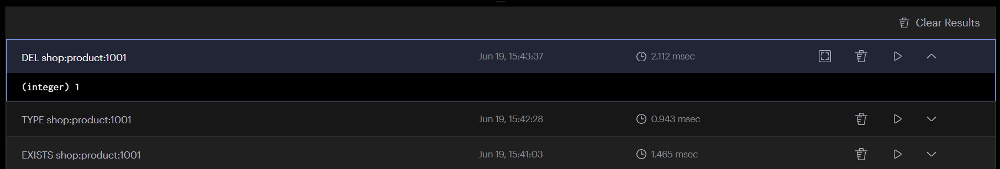

---
- `EXISTS key`: 키가 있으면 `1`, 없으면 `0`
```redis
EXISTS shop:product:1001
```


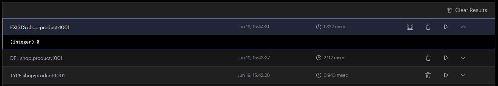

---
## 3. SET 옵션
> 조건을 만족하지 못한 `SET`은 `(nil)`을 반환합니다. `NX`는 간단한 중복 방지에 유용하지만, 복잡한 분산 잠금은 만료와 소유권 확인까지 별도로 설계해야 합니다.

---
- `NX`: 키가 없을 때만 저장
```redis
SET signup:email:user@example.com 1 NX
```
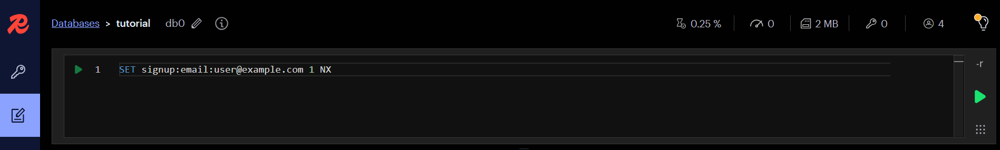

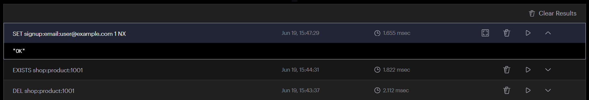

---
- `NX`: 키가 없을 때만 저장
```redis
SET signup:email:user@example.com 1 NX
```


> 이미 저장된 키(signup:email:user@example.com)가 있기 때문에 저장 실패 

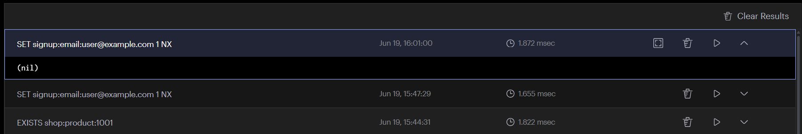

---
- `XX`: 키가 있을 때만 저장
```redis
SET shop:product:1001 "새 이름" XX
```
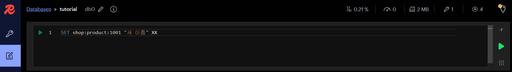

> 저장된 키(shop:product:1001)가 없기 때문에 저장 실패

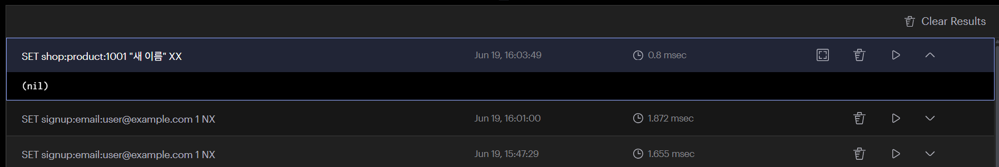

---
- `EX 초`: 저장과 동시에 초 단위 만료 시간 설정
- `PX 밀리초`: 저장과 동시에 밀리초 단위 만료 시간 설정
```redis
SET auth:code:1001 482913 EX 180
```
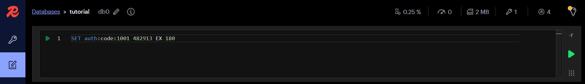

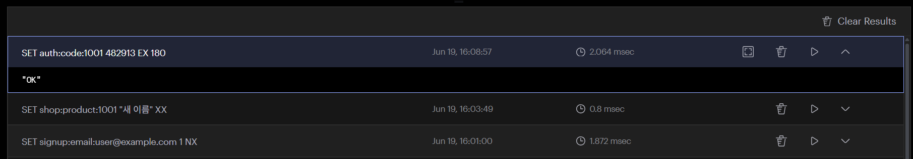

---
## 4. 키 이름 변경
> `RENAME`은 대상 키가 이미 있으면 덮어씁니다. 덮어쓰기를 막으려면 `RENAMENX`를 사용합니다.

---
- 키 생성 
```redis
SET old:key value
```
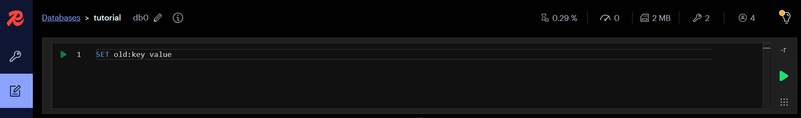

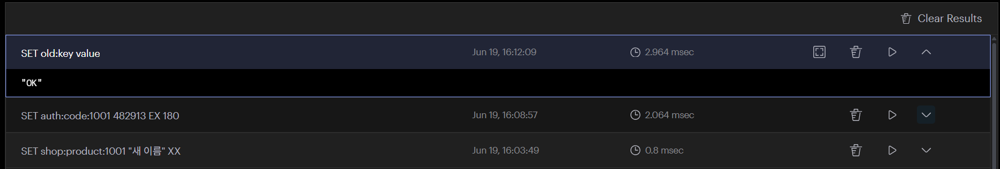

---
- 키 이름 변경 
```redis
RENAME old:key new:key
```
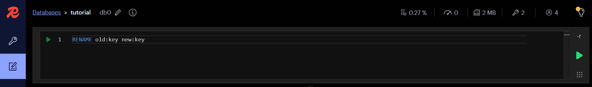

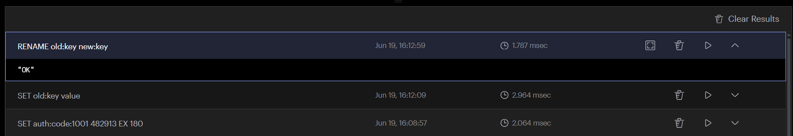

---
- 변경된 키 조회 
```redis
GET new:key
```


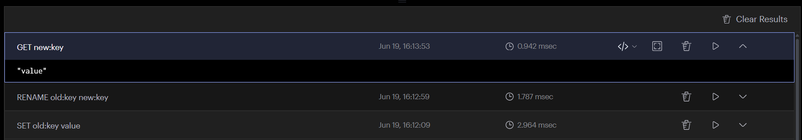

---
## 5. 키 탐색: KEYS와 SCAN

| 항목 | `KEYS` | `SCAN` |
|------|---------|---------|
| 목적 | 조건에 맞는 모든 Key 조회 | Key를 조금씩 나누어 조회 |
| 반환 방식 | 한 번에 전체 반환 | 여러 번 호출하여 순차 반환 |
| 성능 | O(N) (전체 Key 탐색) | O(1) (호출당 평균) |
| 서버 영향 | 데이터가 많으면 Redis가 잠시 응답하지 않을 수 있음 | 서버 부하가 매우 적음 |

---
| 항목 | `KEYS` | `SCAN` |
|------|---------|---------|
| 운영 환경 사용 | 권장하지 않음 | 권장 |
| 개발/테스트 | 사용 가능 | 사용 가능 |
| 결과 개수 | 모든 Key | 일부 Key (Cursor를 이용해 반복 조회) |
| Cursor 사용 | 없음 | 있음 (`0`이 될 때까지 반복) |
| Pattern 검색 | `KEYS user:*` | `SCAN 0 MATCH user:*` |
| COUNT 옵션 | 없음 | 있음 (`COUNT 100` 등) |
| 대표 사용 사례 | 개발 중 데이터 확인 | 운영 서버에서 Key 조회 |

---
### 테스트용 데이터 생성
- `MSET`: 여러 개의 Key-Value를 한 번에 저장하는 명령어(Multiple SET)
```redis
MSET shop:product:1001 "키보드" shop:product:1002 "마우스" shop:product:1003 "모니터"
```
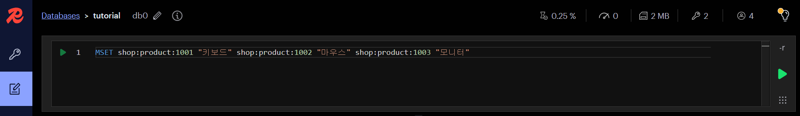

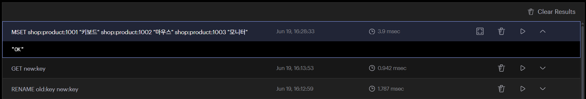

---
### KEYS
- 모든 상품 조회 
```redis
KEYS shop:product:*
```
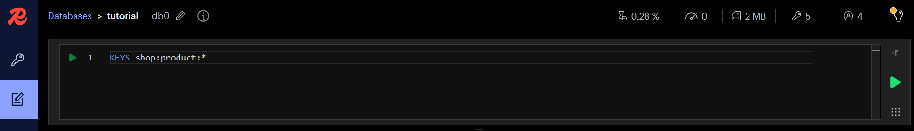

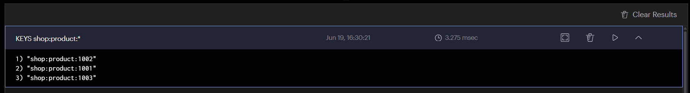

---
- 특정 상품 조회 
```redis
KEYS shop:product:100*
```
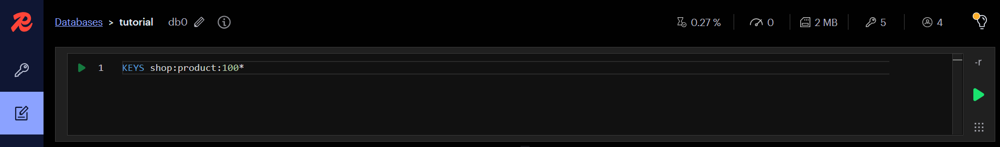

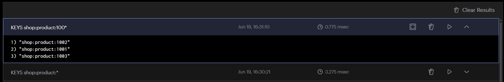

---
### SCAN
- 모든 상품 조회 
```redis
SCAN 0 MATCH shop:* COUNT 100
```


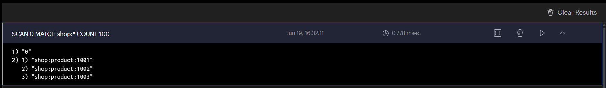

---
- 특정 상품 조회 
```redis
SCAN 0 MATCH shop:product:1001 COUNT 10
```


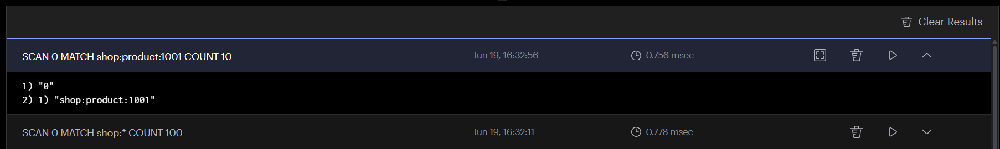
